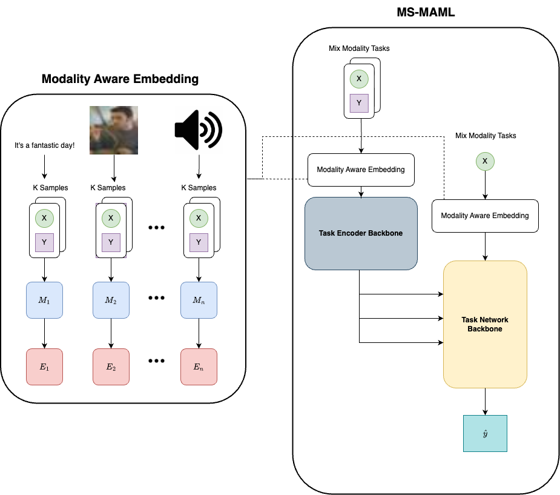

# MS-MAML: modality aware sequential embeddings for Model-Agnostic Meta-Learning on multi-modality and cross domain

This project is an implementation of [**MS-MAML: modality aware sequential embeddings for Model-Agnostic Meta-Learning on multi-modality and cross domain**](), our course project for AML in Tandon, NYU.

> # Abstract
>
> The swift advancement of machine learning technologies demands models that can quickly adjust to a variety of tasks, domains, and modalities. The goal of the Model-Agnostic Meta-Learning \cite{finn2017model} framework is to use meta learning to activate the model's ability to quickly adapt to new tasks. An improved version of MAML called MMAML \cite{vuorio2019multimodal} sought to use modulation to modify meta-learned prior parameters according to the identified mode, allowing for quicker and more efficient adaptation. Nevertheless, these two approaches are limited to tasks involving distinct modalities' feature representations. By introducing the modulation of sequential embeddings, we proposed Modality aware Sequential MMAML (MS-MMAML), which offers a paradigm on the application of meta learning across modalities with different feature representation. Additionally, we evaluated our approach using a variety of modalities in order to estimate its performance and demonstrate the efficacy of sequential embedding across modality. This highlights the potential of our approach to support the creation of multi-modal meta learning systems that are more flexible and effective.

## Modality Aware Sequential MAML

Our aim is to enhance the original MMAML with modalities other than image, qualifying the "multimodal" method.

<p align="center">
    
</p>

## Datasets

We conducted Mix modality MMAML training on three different modalities:

- audio
- language
- vision

For vision, we used the CIFAR-100 used in the original MMAML. For language, we used the Brown dataset. For audio, we used the ESC50 dataset.

Run the following command to download and preprocess the datasets, including all three modalities.

```bash
python get_dataset_script/get_esc.py
python get_dataset_script/get_brown_3000.py
python get_dataset_script/get_cifar.py
```

## Getting started

Please first install the following prerequisites: `wget`, `unzip`.
Our code supports the cutting edge torch, thus, execute the following command and set up the environment:
```bash
conda create -n msmaml
pip install -r requirements.pt2.txt
```

## Usage

After downloading the datasets, we can start to train models with the following scripts.

### Training command

The executed scripts are as in the table:


| modality              | train                    | eval                          |
| :---------------------- | -------------------------- | ------------------------------- |
| audio                 | run_esc50_embed.sh       | run_esc50_embed_eval.sh       |
| text                  | run_brown_embed.sh       | run_brown_embed_eval.sh       |
| vision                | run_cifar_embed.sh       | run_cifar_embed_eval.sh       |
| audio & text          | 2m_cifar_brown.sh        | 2m_cifar_brown_eval.sh        |
| audio & vision        | run_esc50-cifar_embed.sh | run_esc50-cifar_embed_eval.sh |
| text & vision         | 2m_cifar_brown.sh        | 2m_cifar_brown_eval.sh        |
| audio & text & vision | 3m_cifar_brown_esc50.sh  | 3m_cifar_brown_esc50_eval.sh  |

## Results
We have made our results pulic at huggingface repo [ermu2001/SequenceMMAML](https://huggingface.co/ermu2001/SequenceMMAML).
## Related work

- [Model-Agnostic Meta-Learning for Fast Adaptation of Deep Networks](https://arxiv.org/abs/1703.03400) in ICML 2017
- [Multimodal Model-Agnostic Meta-Learning via Task-Aware Modulation](https://arxiv.org/abs/1910.13616)
## Cite the paper

If you find this useful, please cite as following

```
@misc{Zhao2024,
  author = {Yilin Zhao and Minghao Shao},
  title = {MS-MAML: modality aware sequential embeddings for Model-Agnostic Meta-Learning on multi-modality and cross domain},
  year = {2024},
  publisher = {GitHub},
  journal = {GitHub repository},
  howpublished = {\url{https://github.com/ermu2001/AudioMMAML}},
  commit = {Commit hash (optional)},
  accessed = {2024-04-28}
}

```
## Authors
- [Yilin Zhao][ermu2001.github.io/me.io]
- [Minghao Shao][]